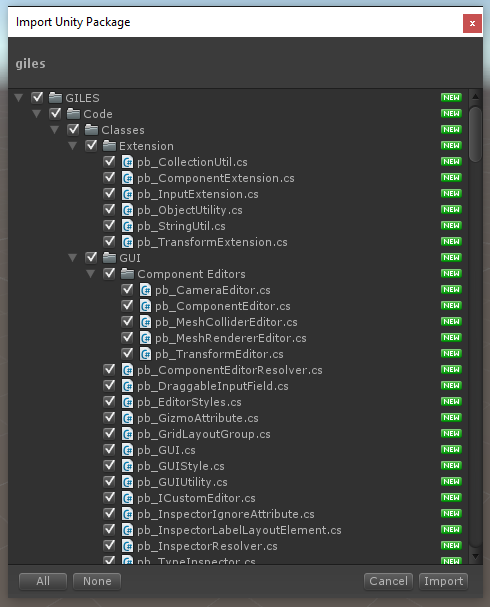

# Quick Start Tutorial

This guide will take you through the basic steps involved in getting **GILES** up and running in your project.

### Install

The first step to integrating **GILES** is to import the `giles.unitypackage` file into your Unity project.  If you have installed **GILES** from the Asset Store, this step should be taken care of for you.  If you've downloaded **GILES** from Github or the User Toolbox, you'll need to open your Unity project and drag the `.unitypackage` into your **Projet** pane.  Make sure that all the assets are selected in the Package Import window.



### Set the .NET Profile

If after importing **GILES** there are now errors in the Console, don't fret.  This just means that your Api Compatibility Level is set to **.NET 2.0 Subset**.

Open *Edit > Project Settings > Player* and in the Inspector change **Api Compatibility Level** to **.NET 2.0**.

### Add the Level Editor Scene

Next you'll need to make the **Level Editor** scene available for users to access.  For this tutorial we'll just open the Level Editor to a new level every time, though it is possible to set up a modal window to select an existing level to edit.  That scenario will be covered in a later tutorial (plus the default Level Editor scene includes a menu item to open a file browser).

The process is just like adding any other scene to your project:

1. Open *File / Build Settings*.
1. Add *GILES / Example / Level Editor* to the **Scenes In Build** list.

Now in your menu scene simply open the "Level Editor" scene.  Check out *GILES / Scenes / Main Menu* for a demonstration of this (specifically, in the hierarchy *Canvas/Panel_Background/Buttons/Btn_LoadMapEditor*).

```
// Unity 5.3 or greater
SceneManager.LoadScene("Level Editor");

// Or in Unity 5.2
Application.LoadLevel("Level Editor");
```

That's it!  The Level Editor is now accessible and ready to start building new levels.  The next step is to give the player some blocks to build with.

### Adding Resources to the Editor

Now that the Level Editor is accessible and running, you'll need some building blocks to populate those levels. 

**GILES** provides 2 ways of making resoures available to the player.  The first (and easiest) method is to use the **Resources / Level Editor Prefabs** folder.

1. Create a new folder named **Resources**.
1. Inside that folder, add a new folder named **Level Editor Prefabs**.
1. Drag a prefab into the **Resources/Level Editor Prefabs** folder.  **GILES** will automatically recognize this as a new resource and tag it with a `pb_MetaDataComponent`.


If there is not a `pb_MetaDataComponent` on the prefab, make sure that the folder names are correct (capitalization matters) and that the object is a prefab (Assets are not allowed).

The alternative method involves creating [Asset Bundles](http://docs.unity3d.com/Manual/AssetBundlesIntro.html).  These are handy for when you want to ship additional resource packs separate from the main game.  Check out [Adding Resources](resources.md) for more information on building Asset Bundles.

### Loading a Saved Scene

Now that the player has built a level, you'll need to load and play it somehow.  In summary, you'll load a new scene then ask **GILES** to instantiate all the objects in a `.json` scene file.  It's easy to extend this to include whatever custom loading steps you'd like, but if you just want to load a new scene **GILES** includes a utility script named `pb_SceneLoader.cs` that makes this super simple.  For this tutorial, we'll use the `pb_SceneLoader` approach.

Somewhere in your main menu, hook up a button to call 

````
// Where the argument is a relative or absolute path to your a saved level.
pb_SceneLoader.LoadScene("Assets/MySavedLevel.json");
````

`pb_SceneLoader` is a singleton, so there's no need to worry about instantiating or managing it's lifecycle.

That's it! The `pb_SceneLoader` singleton will handle opening a new scene for you and loading in the saved level.  If you get a black screen, chances are you either:

1. Didn't include a camera object in the saved scene.
1. Didn't include any lights in the saved scene.

